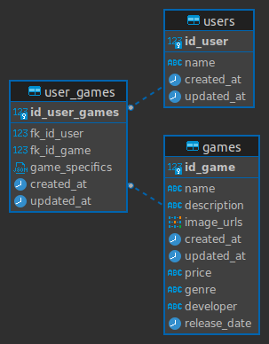

# POGR Game User API

This is a CRUD API for managing game and user data, as well as user-specific games. It provides endpoints to perform Create, Read, Update, and Delete operations on games and users, as well as assigning games to users. The API is built using Node.js and PostgreSQL.

## Requirements

- Node.js (v12 or higher)
- PostgreSQL

## Getting Started

1. Clone the repository:

```bash
git clone https://github.com/coder-neoito/pogr_api_node_rafath/tree/main
```

2. Install the dependencies:

```bash
cd game-user-api
npm install
```

3. Configure the database connection:

   Open the env.development or env.production file and update the PostgreSQL connection details (host, port, database, username, password) according to your setup.

4. Start the development server:

```bash
npm run start:dev
```

5. Start the production server:

```bash
npm run start:prod
```

The API will be accessible at http://localhost:3000.

API Endpoints
User Endpoints

    GET /users: Retrieve all users.
    GET /users/:id: Retrieve a specific user by ID.
    POST /users: Create a new user.
    PUT /users: Update an existing user.
    DELETE /users: Delete a user.

Game Endpoints

    GET /games: Retrieve all games.
    GET /games/:id: Retrieve a specific game by ID.
    POST /games: Create a new game.
    PUT /games: Update an existing game.
    DELETE /games: Delete a game.

User-Game Endpoints

    GET /users/:userId/games/:gameId: Retrieve a specific user-game record by user ID and game ID.
    POST /users/assign: Assign a game to a user.

## DATABASE DIAGRAM


